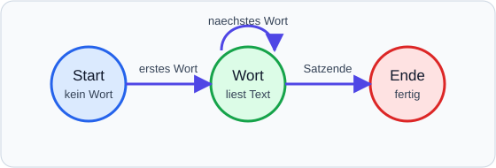
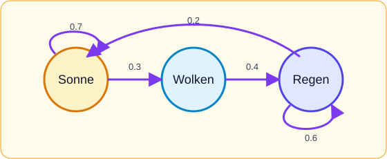

Strings wirken erst einmal wie einfache Texte. Wenn ein Programm aber aus
vielen Texten Muster lernt, entsteht schon eine sehr kleine Vorform von
Sprach-KI. Der wichtige Schritt ist: Das Programm speichert nicht nur den Text
selbst, sondern Beziehungen zwischen Textteilen.

Eine einfache Idee dafür heißt **Markov-Kette**:

> Der nächste Zustand hängt nur davon ab, wo man gerade ist.

Bei Texten kann ein Zustand zum Beispiel ein Wort sein. Das Programm merkt
sich: Nach `"die"` kam oft `"tuer"`, `"karte"` oder `"laterne"`. Danach kann
es selbst neue kurze Texte würfeln.

!!! note Mini-Idee
Eine Markov-Kette versteht die Bedeutung der Wörter nicht. Sie arbeitet mit
Mustern: Was kam nach welchem Wort besonders häufig vor?
!!!

### Endlicher Automat als Bild

Ein **endlicher Automat** besteht aus Zuständen und Übergängen. Er hat nur
endlich viele Möglichkeiten, wo er gerade sein kann. Später in der
theoretischen Informatik wird das noch wichtig.



### Markov-Kette als Automat

Bei einer Markov-Kette stehen an den Pfeilen Wahrscheinlichkeiten. Hier ist
ein winziges Wettermodell:



```python noeditor
Zustand jetzt  -> mögliche nächste Zustände
Sonne          -> Sonne oder Wolken
Wolken         -> Sonne, Wolken oder Regen
Regen          -> Sonne, Wolken oder Regen
```

### Mini-Markov-Generator

Der folgende Code lernt aus kurzen Trainingssätzen, welches Wort nach welchem
Wort kommen darf. Das ist noch keine moderne KI, aber die Grundidee ist
verwandt: Ein Modell wird aus Beispielen gebaut und erzeugt danach etwas
Neues.

Wir gehen dabei in zwei klaren Schritten vor:

1. Aus den Beispielsätzen eine Nachfolger-Liste bauen.
2. Beim Schreiben immer ein mögliches nächstes Wort auswählen.

```python noeditor
from random import choice, seed

seed(7)

saetze = [
    "die karte zeigt den turm",
    "die karte zeigt den hof",
    "der schluessel oeffnet den turm",
    "der schluessel liegt im hof",
]

uebergaenge = {}

for satz in saetze:
    woerter = satz.split()
    for i in range(len(woerter) - 1):
        aktuelles_wort = woerter[i]
        naechstes_wort = woerter[i + 1]

        if aktuelles_wort not in uebergaenge:
            uebergaenge[aktuelles_wort] = []

        uebergaenge[aktuelles_wort].append(naechstes_wort)

wort = "die"
ausgabe = [wort]

for i in range(5):
    moeglichkeiten = uebergaenge.get(wort, [])
    if len(moeglichkeiten) == 0:
        break
    wort = choice(moeglichkeiten)
    ausgabe.append(wort)

print(" ".join(ausgabe))
```

!!! note Was wird gelernt?
Im Dictionary `uebergaenge` steht am Ende für jedes Wort eine Liste möglicher
Nachfolger. Beim Erzeugen wird aus dieser Liste zufällig ein nächstes Wort
ausgewählt.
!!!

### Noch einfacher: Wetter ohne Matrizen

Falls ihr noch keine Matrizen hattet, nutzt dieselbe Idee als Listen:

- Der Schlüssel ist der aktuelle Zustand.
- Die Liste enthält mögliche nächste Zustände.
- Häufige Zustände dürfen mehrfach in der Liste stehen.

```python noeditor
from random import choice, seed

seed(3)

uebergaenge = {
    "Sonne": ["Sonne", "Sonne", "Wolken"],
    "Wolken": ["Sonne", "Wolken", "Regen"],
    "Regen": ["Wolken", "Regen", "Regen"],
}

zustand = "Sonne"
reihe = [zustand]

for i in range(6):
    zustand = choice(uebergaenge[zustand])
    reihe.append(zustand)

print(" -> ".join(reihe))
```

So bekommt ihr das Markov-Prinzip ohne neue Mathematik:

1. Aktuellen Zustand ansehen.
2. Eine erlaubte Folgemöglichkeit wählen.
3. Wiederholen.

Später kann man dieselbe Idee auch mit Tabellen oder Matrizen schreiben. Für
jetzt reicht diese Listen-Version vollkommen.
